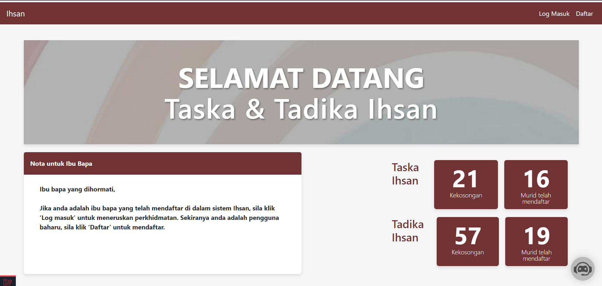
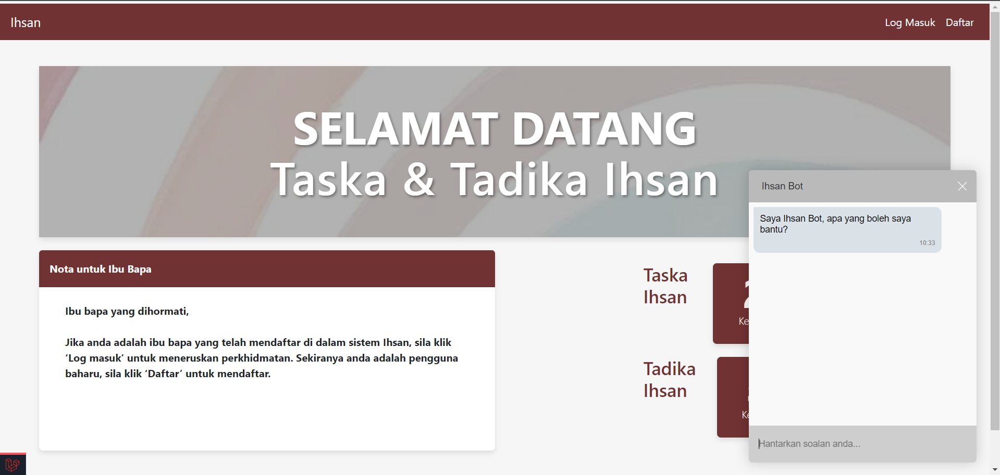
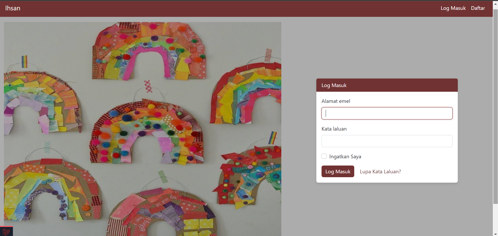
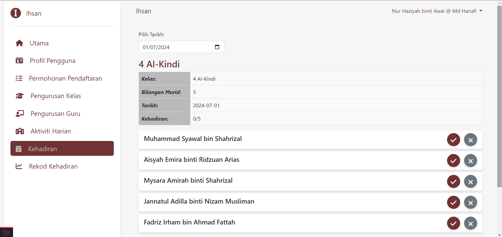

# Ihsan - UTM Child Care Management System

## Project Description

Ihsan is a web application developed to streamline the management of child care centers at Universiti Teknologi Malaysia (UTM). The system is designed to assist administrators in managing children's records, attendance, billing, and communications with parents efficiently. Additionally, parents of Taska and Tadika Ihsan are able to apply for children placement in the child care centers, pay for the child's monthly fees, and view their daily activities. By providing an intuitive interface and automated processes, Ihsan aims to reduce administrative overhead and improve the overall management experience for UTM's child care centers.

## Key Features

- **Child Registration and Management:** Easily register and manage children's profiles.
- **Billing and Payment Processing:** Integrate with Stripe for secure online transactions, track payment history, and generate PDF receipts.
- **Class and Rooms Management:** Assign classes and rooms to the students and teachers of Taska and Tadika Ihsan.
- **Attendance Tracking:** Monitor and record daily attendance, enabling quick access to attendance history.
- **Daily Child Activity:** Update daily child activity (with media for Taska students).
- **Chatbot Feature:** Enable chat features for frequently asked questions.
- **User Role Management:** Assign different roles (Admin, Staff, Parent) with appropriate access levels and permissions.
- **Secure Authentication and Data Protection:** Ensure data privacy and security with encrypted authentication and secure data storage.

## Technologies Used

- Laravel (PHP Framework)
- HeidiSQL (Database)
- Bootstrap (CSS Framework)
- JavaScript & Livewire (Frontend Functionality)
- Stripe (Payment Gateway)

## Installation Instructions

To set up Ihsan on your local machine, follow these steps:

Install dependencies:

```bash
composer install
```

Generate the application key:

```bash
php artisan key:generate
```

Run migrations and seed the database:

```bash
php artisan migrate --seed
```

Start the development server:

```bash
php artisan serve
```

## Usage

After installation, you can start using the Ihsan application:

**Admin Login:**

Email: admin@example.com  
Password: 12345678

Navigate through the Dashboard to access various features such as Child Management, Attendance Tracking, Billing, and more.

## Screenshots

### Welcome Page
#### Landing Page


#### Chatbot feature


#### User Registration Page


#### Login Page


### Dashboard
#### Dashboard Admin


#### Dashboard Staff


#### Dashboard Parent


### Application Pages
#### Create New Application


#### Application Status


#### Update Application


### Payment Pages
#### Payment History 


#### Make Payment


#### Payment Receipt


### Class Management Pages
#### Class List


#### Taking Attendance


#### Attendance Report


### Child Activity
#### Update Child Activity for Taska (Staff)
.png)

#### Update Child Activity for Tadika (Staff)
.png)

#### View Child Activity for Taska (Parent)
.png)  
.png)

#### View Child Activity for Tadika (Parent)
.png)

## Contact Information
For any inquiries or further information, you can reach me at:

Email: hannanjamaludin37@gmail.com  
LinkedIn: [Nur Hannan Jamaludin](https://www.linkedin.com/in/nur-hannan-jamaludin/).  

## Acknowledgments
UTM Faculty of Computing for guidance and support.  
Open-source contributors for the libraries and tools that made this project possible.